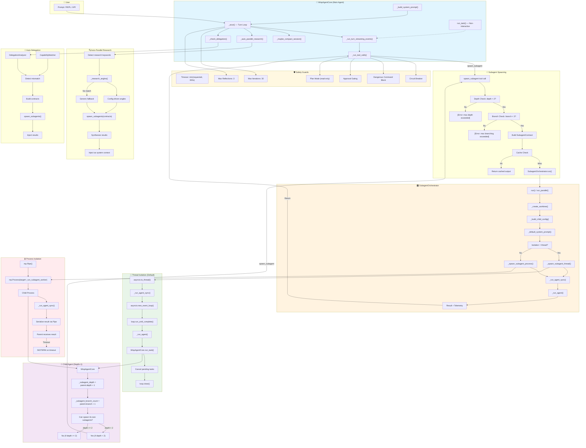

# Wisp Agent + Subagent Architecture



## Legend

| Component | Color | Description |
|-----------|-------|-------------|
| 🔮 Main Agent | Blue | `WispAgentCore` — primary agent loop |
| 🎛️ Orchestrator | Orange | `SubagentOrchestrator` — manages subagent lifecycle |
| 🧵 Thread Mode | Green | Default isolation, fast, shared memory |
| 🔒 Process Mode | Red | Sandboxed, truly killable, pipe IPC |
| 👶 Child Agent | Purple | Subagent with depth+1, can spawn if depth < 2 |
| 🛡️ Safety | Yellow | Guards against runaway execution |

## Key Flows

### 1. Single Subagent Spawn
```
User Prompt → _arun() → tool_calls → spawn_subagent
    → Depth Check (depth < 2?) → Branch Check (branch < 3?)
    → Build Contract → Cache Check → Orchestrator.run()
    → Thread/Process → _run_agent_sync() → run_task()
    → Return output to parent
```

### 2. Parallel Subagents (Research)
```
User Prompt → _auto_parallel_research()
    → Detect keywords → _research_angles()
    → Build 2-4 contracts → spawn_subagents()
    → Parallel execution → Synthesize → Inject context
```

### 3. Auto-Delegation
```
User Prompt → _check_delegation()
    → DelegationAnalyzer + CapabilityMatcher
    → Detect mismatch → Build contracts
    → spawn_subagents() → Inject results
```

### 4. Nested Subagent (Depth 2)
```
Main Agent (depth=0)
    → Spawns Worker (depth=1)
        → Worker spawns Task Agent (depth=2)
            → Task Agent tries to spawn → BLOCKED (depth >= 2)
```

## Configuration

```json
{
  "max_subagent_depth": 2,
  "max_subagent_branching": 3,
  "max_subagent_timeout": 300,
  "research_angles": {
    "docker": ["Containers", "Orchestration", "Security"],
    "kubernetes": ["Architecture", "Operators", "Networking"]
  }
}
```
