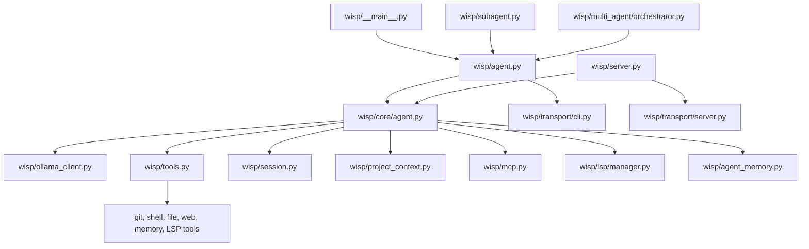
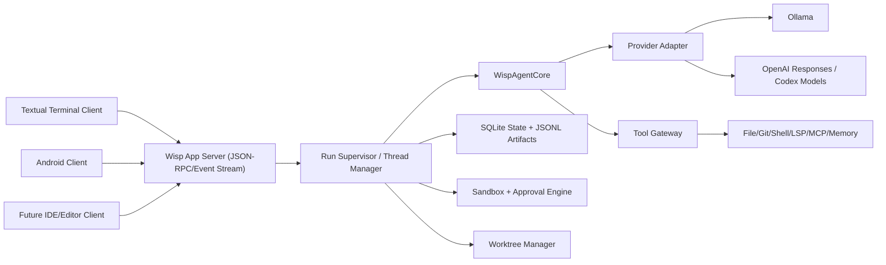

# Codex-Like Terminal App Design for Wisp

Date: 2026-05-07

## Dependency Graph First

The requested app naturally decomposes into this dependency graph:

1. **Workspace understanding**
   Current Wisp modules, data model, transports, tool system, session model.
2. **External research**
   Publicly documented Codex surfaces, protocols, tools, safety model, and model stack.
3. **Gap analysis**
   What Wisp already has, what Codex-like behavior requires, what should remain provider-agnostic.
4. **Target architecture**
   Runtime, UI, safety, persistence, parallelism, remote control, and extensibility.
5. **Implementation roadmap**
   Sequenced phases that preserve current functionality while converging on the target design.

This document follows that order.

## Scope and Assumptions

- The goal is **not** to clone OpenAI Codex internals exactly.
- The goal **is** to build a **Codex-like terminal app experience for the current working directory project**, using Wisp as the starting point.
- The recommended design keeps Wisp's local-first identity and adds an **optional OpenAI-native backend path** instead of replacing Ollama support.
- Public OpenAI docs describe product behavior, interfaces, and safety concepts, but they do **not** fully disclose every internal implementation detail of the Codex desktop app. Where this document goes beyond the public docs, those parts are marked as **design inference**.

## Executive Summary

Wisp already contains most of the hard backend primitives needed for a Codex-like terminal agent:

- an event-driven agent core
- CLI and server transports
- session persistence and compaction
- project-context detection
- LSP integration
- MCP integration
- subagents and multi-agent orchestration
- tool execution with basic safety checks
- Android and remote-server support

What Wisp is still missing is the **product shell** that makes Codex feel like Codex:

- a richer full-screen terminal UX
- first-class thread/worktree management
- a strong approval queue and safety boundary
- a structured runtime protocol between clients and the agent core
- better artifact, review, and background-task workflows
- optional OpenAI Responses/Codex provider support

The best path is **not** a rewrite. The best path is to keep the Python agent core and build a new **terminal supervisor + app-server layer** around it, then let the TUI, remote server, and Android client all speak the same protocol.

## Official Codex Research Snapshot

### What the official docs confirm

As of **May 7, 2026**, OpenAI's public docs describe Codex as a coding agent that spans:

- **CLI**
- **Desktop/App**
- **IDE integrations**
- **App server / remote client mode**
- **cloud and local execution modes**
- **sandboxing and approval controls**
- **tool-rich model runtimes**

Publicly documented Codex capabilities include:

- local, worktree, and cloud execution modes
- background tasks and automations
- thread/task management
- subagents
- MCP and connectors
- AGENTS.md project instructions
- terminal shell access
- code review flows
- IDE and remote development support

### Model/runtime plane

The official model docs show two especially relevant building blocks:

1. **GPT-5.3-Codex**
   - optimized for agentic coding
   - supports low/medium/high/xhigh reasoning
   - supports long-context coding workloads
   - the official model page shows a **400,000 token context window** and **128,000 max output tokens**

2. **GPT-5.4**
   - general high-end model with strong tool support
   - the official model page lists support for:
     - hosted shell
     - local shell
     - apply patch
     - web search
     - remote MCP
     - tool search
     - skills
     - image generation
     - computer use

### App/client plane

The Codex app docs describe a client/server shape that is very relevant for Wisp:

- Codex exposes an **app-server** mode
- that app-server can communicate over **stdio or WebSocket**
- the official docs say the VS Code extension uses that protocol
- the protocol is **JSON-RPC**
- the published methods include thread and turn lifecycle, shell commands, skills listing, compaction, and history access

This is the strongest public clue about how OpenAI keeps multiple Codex surfaces aligned: the UXs are likely different, but the runtime contract is unified.

### Safety plane

OpenAI's Codex security docs explicitly separate:

- **approval policies**
- **sandboxing modes**
- **filesystem/network restrictions**
- **protected paths**

The docs describe multiple filesystem profiles and note that **workspace-write disables network access by default**. The key architectural point is that safety is not just a prompt rule; it is an execution boundary.

### Product behavior plane

The official docs also show that Codex is productized around workflows, not just prompts:

- `/review` is a first-class CLI command
- threads can be run in parallel
- app features include local/worktree/cloud modes
- automations and notifications are built into the product surface

## Confirmed vs Inferred

### Confirmed from public OpenAI docs

- Codex spans app, CLI, IDE, and app-server surfaces.
- The app-server uses JSON-RPC over stdio or WebSocket.
- Codex supports approvals, sandboxing modes, protected paths, and worktree-style execution choices.
- OpenAI exposes models and tool capabilities suitable for a coding agent runtime.

### Inferred for design purposes

- The desktop/app, CLI, and IDE likely share a common runtime protocol and event model.
- A production-grade Codex-like app benefits from a dedicated supervisor layer above the model loop.
- The best Wisp evolution path is to formalize a runtime protocol and let every client speak it.

## Current Wisp Architecture

The current repository is already close to a layered agent system.

### Existing dependency graph

### Reusable strengths already in the codebase

- `wisp/core/agent.py`
  Pure-ish event-driven agent core with transport separation.
- `wisp/transport/cli.py`
  Existing terminal transport and input loop.
- `wisp/server.py`
  Existing remote-control/server surface.
- `wisp/session.py`
  Session persistence and compaction logic.
- `wisp/project_context.py`
  Automatic workspace detection and prompt enrichment.
- `wisp/tools.py`
  Tool registry and execution with path controls and dangerous-command heuristics.
- `wisp/mcp.py`
  MCP server discovery and tool exposure.
- `wisp/lsp/manager.py`
  Language-aware diagnostics and symbol intelligence.
- `wisp/subagent.py`
  Delegated worker pattern already exists.
- `wisp/multi_agent/orchestrator.py`
  Multi-agent coordination and workspace locking already exist.

### What the current product surface lacks

- no full-screen TUI with persistent panes
- no first-class approval inbox
- no thread/worktree navigator
- no unified runtime protocol for all clients
- no provider abstraction beyond Ollama as the primary model path
- no strong OS sandbox abstraction
- no artifact/review panel comparable to Codex workflows
- remote server and terminal UX are still separate surfaces instead of one protocol family

## Gap Analysis

| Capability | Wisp Today | Codex-Like Target |
|---|---|---|
| Agent core | Strong | Keep |
| Provider support | Mostly Ollama-centric | Provider abstraction: Ollama + OpenAI Responses |
| Terminal UX | REPL + streaming text | Full-screen TUI with panes, queue, threads, diffs |
| Sessions | JSON session files | Thread/task database plus resumable artifacts |
| Compaction | Present | Keep and expose in UI |
| Tools | Good local tool coverage | Normalize tools under capability registry |
| MCP | Present | Keep and elevate in UX |
| LSP | Present | Keep and surface in review/debug flows |
| Safety | Heuristic command blocking | Real sandbox abstraction + approval engine |
| Parallel work | Present in backend | Expose visibly with threads/worktrees |
| Remote/Android | Present | Rebase on shared app-server protocol |

## Architecture Options

### Option A: Incremental CLI polish

Keep the current REPL and add better Rich rendering, command palette behavior, and improved slash commands.

**Pros**

- fast
- low risk
- minimal refactor

**Cons**

- still feels like an enhanced REPL, not a Codex-like app
- hard to scale to parallel threads, approvals, artifacts, and remote clients

### Option B: Recommended hybrid architecture

Keep the Python core, add a **Wisp app-server** protocol layer, and build a **Textual-based terminal client** on top of it.

**Pros**

- preserves most existing backend logic
- creates one protocol for TUI, server, Android, and future IDE integrations
- supports thread/worktree/task panes naturally
- aligns closely with the public Codex app-server shape

**Cons**

- moderate refactor
- requires careful event-schema design

### Option C: Full rewrite in Rust or Go

Rebuild the CLI/runtime from scratch in a systems language.

**Pros**

- maximum performance
- easier low-level sandbox integration in some cases

**Cons**

- throws away strong existing Python agent investments
- slower path to product value
- highest risk

### Recommendation

Choose **Option B**.

It gives Wisp a Codex-like product architecture without discarding the current core. It also turns the current Android and remote-server work into a long-term advantage rather than a side branch.

## Recommended Target Architecture

### Layer 1: Client surfaces

Build three surfaces against one protocol:

- **Terminal TUI**
  The primary Codex-like experience.
- **Remote server/client**
  Reuse for Android and future web/desktop control.
- **Future editor integration**
  Optional, but becomes much easier once the protocol is formalized.

### Layer 2: App server / runtime protocol

Introduce a new internal/runtime protocol called `wisp app-server`.

It should:

- speak JSON-RPC over stdio and WebSocket
- stream structured events
- expose thread lifecycle
- expose approvals as explicit requests
- expose tool call results and artifact metadata
- support compaction, history fetch, skills listing, and shell command requests

This is the single biggest architectural change that unlocks a real product shell.

### Layer 3: Run supervisor

Add a supervisor above `WispAgentCore`.

Responsibilities:

- thread lifecycle
- task queueing
- worktree creation and cleanup
- approval workflow
- artifact tracking
- background task state
- cancellation and retry
- routing subagent results back into the parent thread

Today, some of this logic is spread across the agent, transport, and server surfaces. It should move into one orchestration layer.

### Layer 4: Provider abstraction

Add a provider interface such as:

- `Provider.generate()`
- `Provider.stream()`
- `Provider.list_models()`
- `Provider.tool_capabilities()`
- `Provider.supports_reasoning_effort()`

Initial providers:

1. **OllamaProvider**
   Preserve Wisp's local-first behavior.
2. **OpenAIResponsesProvider**
   Optional provider for Codex-like hosted model/tool workflows.

This lets Wisp emulate Codex workflows without forcing OpenAI as the only backend.

### Layer 5: Tool gateway

Keep `wisp/tools.py`, but put it behind a capability-aware gateway.

The gateway should distinguish:

- local tools
- MCP tools
- provider-native hosted tools
- privileged/dangerous tools
- review-only and read-only tools

This is where approval rules and sandbox policy checks should happen before execution.

### Layer 6: Persistence and artifacts

Wisp's current JSON session model is fine for simple history, but a Codex-like app needs richer state:

- threads
- runs
- approvals
- artifacts
- worktrees
- background jobs
- notifications

Recommended persistence split:

- **SQLite**
  authoritative state for threads, tasks, approvals, runs, worktrees, and metadata
- **JSONL transcripts**
  append-only event logs for replay and debugging
- **filesystem artifacts**
  rendered diffs, patches, run summaries, and exported review reports

### Layer 7: Safety boundary

Codex-like safety cannot rely on prompt instructions and regex checks alone.

Add a `SandboxManager` abstraction:

- `NoSandbox`
- `MacOSSandbox`
- `LinuxBubblewrapSandbox`
- `WSLBoundary` or `ProcessRestrictedMode` for Windows-first fallback

Pair that with an `ApprovalPolicyEngine`:

- `never`
- `on-request`
- `on-failure`
- `untrusted`

This mirrors the shape of public Codex controls more closely than the current heuristics.

## Proposed Terminal UX

The terminal experience should feel like an app, not a transcript.

### Main layout

- **Left pane**
  Threads, worktrees, and background tasks.
- **Center pane**
  Conversation + streamed answer + tool timeline.
- **Right pane**
  Current task metadata, approval queue, artifacts, and file diffs.
- **Bottom composer**
  Multiline prompt input with slash commands and quick actions.

### Required interactions

- start a new task in the current repo
- fork into a new worktree
- inspect pending approvals
- view changed files before commit
- run review mode
- launch subagents and watch status
- resume any prior thread
- switch provider/model without restarting

### Key product behaviors

- background tasks remain visible even while the user keeps chatting
- approvals interrupt cleanly but do not corrupt the run
- diffs and test summaries become first-class artifacts
- remote clients see the same structured state as the terminal app

## Proposed Tech Stack

### Core runtime

- **Language:** Python
- **Runtime target:** keep `>=3.10` compatibility initially, aim for `3.11+` as the preferred runtime
- **Reason:** the existing codebase is already Python-heavy and the agent ecosystem, MCP handling, server code, and tests are here

### Terminal UI

- **Textual**
  Best fit for a stateful full-screen terminal app.
- **Rich**
  Existing conceptual fit for styled output, diffs, trees, trace blocks.
- **prompt_toolkit**
  Use for a powerful multiline composer, history, completion, and keybindings where Textual alone is awkward.

### Backend service surface

- **FastAPI + WebSocket**
  Keep for remote control and external clients.
- **JSON-RPC message layer**
  Add on top for consistency with the app-server pattern.
- **Pydantic v2**
  Useful for event schemas, protocol contracts, approval payloads, and persistence DTOs.

### Persistence

- **SQLite**
  threads, approvals, tasks, worktrees, notifications, run metadata
- **JSONL**
  event stream replay and debugging
- **existing config files**
  retain for user-configurable defaults and MCP/LSP config

### Model providers

- **Ollama**
  default local-first provider
- **OpenAI Responses API**
  optional hosted provider for Codex-style behavior

Recommended OpenAI model policy in this design:

- **GPT-5.3-Codex** for coding-first agent runs
- **GPT-5.4** for general research-heavy or multimodal tasks when needed

### Code intelligence

- **LSP**
  keep current manager
- **tree-sitter**
  keep for structural indexing
- **ripgrep**
  use for fast workspace search

### Safety and isolation

- **bubblewrap** on Linux where available
- **macOS sandbox wrapper** for Darwin
- **explicit protected-path registry**
- **approval engine**

### Testing

- **pytest**
  continue as the main test runner
- **snapshot tests**
  for event streams and rendered summaries
- **terminal integration tests**
  with `pexpect` or equivalent
- **protocol contract tests**
  for app-server methods and event payloads

## Proposed Internal Modules

### New modules

- `wisp/app_server.py`
  JSON-RPC server over stdio and WebSocket.
- `wisp/runtime_protocol.py`
  request/response/event schemas.
- `wisp/supervisor.py`
  run orchestration, thread state, approvals, cancellation.
- `wisp/providers/base.py`
  provider contract.
- `wisp/providers/ollama.py`
  migrated Ollama adapter.
- `wisp/providers/openai_responses.py`
  optional OpenAI provider.
- `wisp/tui/app.py`
  Textual application root.
- `wisp/tui/screens/*.py`
  thread view, approvals, settings, artifacts.
- `wisp/tui/widgets/*.py`
  diff pane, run timeline, composer, status bars.
- `wisp/persistence/sqlite_store.py`
  thread/run/task/worktree state.
- `wisp/sandbox.py`
  sandbox abstractions and policies.
- `wisp/worktrees.py`
  git worktree lifecycle.
- `wisp/artifacts.py`
  test summaries, diffs, review bundles.

### Existing modules to refactor, not replace

- `wisp/core/agent.py`
  keep as the model loop heart.
- `wisp/agent.py`
  shrink into compatibility wrapper.
- `wisp/transport/cli.py`
  keep for non-TUI fallback mode.
- `wisp/server.py`
  rebase on shared runtime protocol.
- `wisp/session.py`
  preserve compaction logic, migrate long-term indexing/state elsewhere.
- `wisp/tools.py`
  wrap in capability and approval gateway.

## End-to-End Execution Flow

### Interactive task in the current working directory

1. User opens the terminal app in a repo.
2. TUI connects to `wisp app-server`.
3. App-server loads or creates a thread bound to the repo.
4. Supervisor enriches the run with:
   - project context
   - AGENTS/skills
   - memory/session summary
   - active worktree metadata
5. Agent core streams events through the protocol.
6. Tool requests enter the approval engine if required.
7. Accepted tool calls execute inside the selected sandbox/worktree.
8. Results and artifacts stream back to the UI.
9. Thread state, run metadata, and artifacts persist automatically.

### Review flow

1. User triggers `/review` or a review action from the UI.
2. Supervisor builds a review artifact from git diff, diagnostics, tests, and changed files.
3. Agent runs in reviewer mode.
4. Findings are emitted as structured comments and an overall summary.
5. User can jump directly into each file/diff from the finding list.

### Parallel subagent flow

1. Parent task spawns one or more delegated runs.
2. Supervisor allocates worktrees or shared-read mode depending on policy.
3. Each child run reports events independently.
4. Parent thread sees sidecar progress and final outputs as artifacts.
5. User can cancel or promote a child run's results into the main thread.

## Phased Implementation Plan

### Phase 1: Provider and protocol foundation

**Goal**
Create the structural base without breaking the current CLI.

**Deliverables**

- provider abstraction
- JSON-RPC/event schema
- supervisor skeleton
- SQLite store
- compatibility bridge from old session model

### Phase 2: First Codex-like terminal app

**Goal**
Ship a usable full-screen TUI backed by the new protocol.

**Deliverables**

- Textual app shell
- thread list
- conversation pane
- approval queue
- status/timeline pane
- multiline composer
- fallback to old CLI mode for unsupported terminals

### Phase 3: Worktrees, review, and artifact workflows

**Goal**
Move from "chat agent" to "coding workstation".

**Deliverables**

- worktree manager
- diff viewer
- structured `/review`
- test/run artifacts
- resumable background tasks

### Phase 4: Real safety boundary

**Goal**
Replace heuristic-only guardrails with enforceable runtime isolation.

**Deliverables**

- sandbox manager
- protected path registry
- approval policy engine
- unsafe-tool audit logging

### Phase 5: Unified multi-surface runtime

**Goal**
Make terminal, server, Android, and future clients all speak the same runtime.

**Deliverables**

- shared app-server protocol everywhere
- Android client upgrade path
- remote development mode
- future IDE integration path

### Phase 6: Optional OpenAI-native mode

**Goal**
Let Wisp run with a Codex-like hosted backend when desired.

**Deliverables**

- OpenAI Responses provider
- model selection policy
- mapping for hosted/native tool capabilities
- provider-aware UX messaging

## Main Risks

### Risk 1: Overbuilding the UI before the protocol

If the TUI is built directly on today's CLI transport, the product will become harder to evolve. The protocol/supervisor work must come first.

### Risk 2: Mixing session history and operational state

JSON transcript files are not enough for approvals, artifacts, background tasks, and worktrees. Use SQLite for operational state early.

### Risk 3: Safety theater

Regex checks alone are not a real Codex-like safety model. If strong sandboxing is postponed too long, the product will look like Codex without matching its execution safety.

### Risk 4: Provider lock-in in the opposite direction

Wisp should not become "OpenAI-only" just because Codex inspired the UX. Keep the provider layer clean so Ollama remains first-class.

## Recommendation

Build the next version of Wisp as a **Python-based, Textual-powered terminal app backed by a new app-server/supervisor layer**.

That approach:

- preserves the existing agent investment
- aligns with the public Codex architecture shape
- makes Android/remote work more valuable
- supports both Ollama and OpenAI backends
- creates a durable base for richer approval, review, and multi-thread workflows

## Suggested Next Deliverable

The next document after this one should be an implementation plan focused only on:

1. provider abstraction
2. runtime protocol
3. supervisor state model
4. first TUI shell

That is the smallest slice that materially moves Wisp toward a Codex-like product.

## Source Links

Official OpenAI sources used for this research:

- [Codex CLI Overview](https://developers.openai.com/codex/cli)
- [Codex CLI Features](https://developers.openai.com/codex/cli/features)
- [Codex App Overview](https://developers.openai.com/codex/app)
- [Codex App Features](https://developers.openai.com/codex/app/features)
- [Codex App Server](https://developers.openai.com/codex/app-server)
- [Codex Sandboxing](https://developers.openai.com/codex/concepts/sandboxing)
- [Codex Agent Approvals and Security](https://developers.openai.com/codex/agent-approvals-security)
- [AGENTS.md Guide](https://developers.openai.com/codex/guides/agents-md)
- [GPT-5.3-Codex Model Page](https://developers.openai.com/api/docs/models/gpt-5.3-codex)
- [GPT-5.4 Model Page](https://developers.openai.com/api/docs/models/gpt-5.4)
- [OpenAI Codex CLI Getting Started](https://help.openai.com/en/articles/11096431-openai-codex-cli-getting-started)
